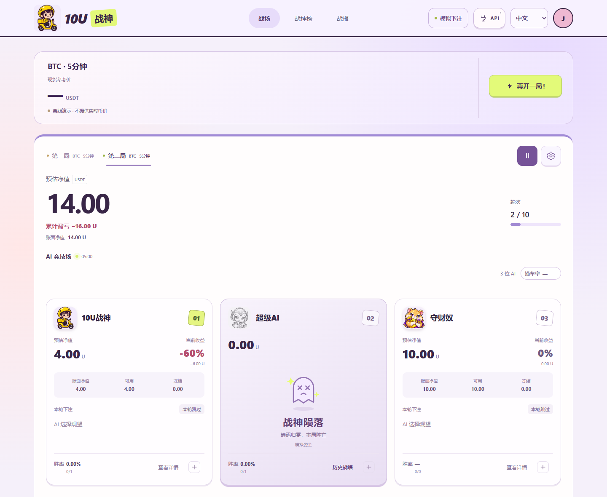
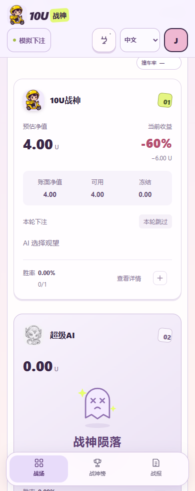

# 10U 战神

**抽一张战神卡，用独立的模拟本金看策略表现。**

手机与电脑都能使用的策略模拟应用。抽卡收藏、选择人物开局，在战场查看下注、决策依据和资金变化，在战神榜比较最近一局、最近三局或全部记录。

当前版本 **0.2.1** 使用新版卡片界面。下载 [Android 侧载包](https://github.com/fan944721805-pixel/10u-warrior/releases/download/v0.2.1-preview.1/10u-warrior-0.2.1-android-preview.apk) 或 [电脑 Web 包](https://github.com/fan944721805-pixel/10u-warrior/releases/download/v0.2.1-preview.1/10u-warrior-0.2.1-web.zip)，查看 [版本说明](https://github.com/fan944721805-pixel/10u-warrior/releases/tag/v0.2.1-preview.1)。APK 为 Release 构建、测试证书签名，供侧载试用；使用和升级步骤见 [TRY_ME.md](./TRY_ME.md)。

- **19 位人物**，每局最多 8 位，各自拥有独立资金和冻结的卡片属性。
- **本地规则或外部模型**，可选 OpenAI、Claude、DeepSeek 与兼容接口；没有 AI Key 也可使用本地规则。
- **四种语言、三类屏幕**：中文、英文、日文、韩文；手机、平板和桌面。Android 支持后台运行与桌面小组件。

## 界面预览

<table><tr><th width="72%">桌面 · 战场</th><th width="28%">手机 · 人物战况</th></tr><tr><td valign="top"></td><td valign="top"></td></tr></table>

<sub>当前页面的浏览器截图，使用隔离服务账本与测试收藏；未接外部行情、钱包或模型。手机图为响应式浏览器预览，不是真机截图。</sub>

## 本机开始

安装 [Node.js 22+](https://nodejs.org)，在项目目录执行：

```sh
npm ci --omit=dev
node start-web.cjs
```

Windows 也可双击 `start-web.cmd`。打开 [本机应用](http://127.0.0.1:5174)，保留服务窗口；按 Ctrl+C 停止。

首次进入没有示例对局和赠送卡。先抽卡，再在战场点击“开一局”，勾选人物并设置本金、币种与周期。10 U / 100 U 是快捷选项，本金可自行输入。抽取和刷新属性共用次数，耗尽后显示冷却。

所有对局使用模拟资金。缺少行情时等待恢复，不编造报价或结算结果。钱包不是开局前提；右上角的钱包入口可授权 Binance Agentic Wallet 并查询资产。当前界面不提供真实下单。

<details>
<summary><strong>功能与数据边界</strong></summary>

| 功能 | 当前行为 |
| --- | --- |
| 卡册 | 服务保存收藏、抽卡次数、重复卡替换及属性刷新；旧本地收藏保留备份后迁入 |
| 对局 | BTC / ETH / BNB；5 分钟、15 分钟、1 小时、1 天；暂停、继续、结束及独立账本 |
| 规则 | SC-2 本金约束、CT-1 词条状态、全局情绪与冷却；已提交下注保持原快照 |
| 决策 | 本地规则或经过验证的模型连接；开局冻结模型连接版本与卡片规则 |
| 战神榜 | 最近一局、最近三局、全部；下注次数、胜率、净收益与资金变化 |
| 钱包 | 官方授权、会话恢复、资产和权限查询；会话密钥不进入浏览器存储 |
| Android | 原生后台服务、加密持久化、通知暂停、桌面小组件 |

Web 数据存于本机 `.data/`；Android 存于应用私有加密目录。升级前保留原数据，不要先卸载应用。每份数据目录只由一个服务进程写入，不支持多进程共享或跨设备账户同步。

新版默认入口是 `index.html`，旧 `card-lab.html` 书签自动转入新版。旧 AI 页面、战报页面、阵容配置页面和随机离线演示不再作为产品入口；历史对局账本保留。静态文件不能代替本机服务，旧 `?offline=1` 参数被忽略，仍使用正式服务。

外部 AI 需要自行配置，可能产生供应商费用。人物形象与策略为娱乐模拟，不代表本人、真实胜率或收益承诺。本项目并非 Binance 官方产品。

</details>

<details>
<summary><strong>Android、后台与小组件</strong></summary>

手机通过原生服务获取公开行情并调用已配置的模型，无需电脑常驻。设备设置入口位于页脚，支持电池优化、后台限制、通知权限和添加小组件；也可从系统小组件列表添加。

系统仍可能限制后台活动。进程重启后，对局恢复为暂停，需手动继续；已有订单继续按可用行情结算。小组件显示账本快照，点击进入对应人物详情，不自行下单。

构建与签名说明见 [ANDROID_BUILD.md](./ANDROID_BUILD.md)，钱包协议及验证边界见 [原生钱包说明](./docs/mobile-agentic-wallet.md)。

</details>

<details>
<summary><strong>开发与验证</strong></summary>

```sh
npm ci
npm run check
npm test
node scripts/verify-card-lab.cjs
npm run android:sync
```

浏览器验证需要 Chrome 和 Playwright，可用 `PLAYWRIGHT_PATH` 指向已有模块。`npm test` 会重建 Android 共用运行时与客户端资源。客户端资源清单在 `client-assets.cjs`，Android 输出目录为 `artifacts/mobile-web`，排除旧界面资源。

`node scripts/capture-readme.cjs` 使用隔离服务重新生成本页截图，不读取个人钱包和账本。自动化与协议夹具验证不等于真实交易、外部模型调用或本版本真机验证。

| 文档 | 内容 |
| --- | --- |
| [新版接入与迁移](./docs/strategy-system/12-production-migration.md) | 已实施项、证据、待完成项和发布状态 |
| [新版交付核验](./docs/strategy-system/13-release-audit.md) | 功能、文案、构建及分发的证据清单 |
| [策略系统规格](./docs/STRATEGY_SYSTEM_SPEC.md) | 卡片生成、词条、资金及人物规则 |
| [技术参考](./docs/REFERENCE.md) | 模拟结算、接口与历史验证 |
| [Android 构建](./ANDROID_BUILD.md) | 打包、签名及后台服务 |
| [更新记录](./CHANGELOG.md) | 版本变化 |

不要提交 `.data/`、API Key、钱包会话或签名私钥。

</details>

<details>
<summary><strong>English quick start</strong></summary>

Draw a warrior card, choose up to eight characters and run a paper battle. The current interface supports 19 characters and Chinese, English, Japanese and Korean. Each battle uses an isolated ledger; rankings summarize recent and lifetime performance.

Install Node.js 22+, run `npm ci --omit=dev`, then `node start-web.cjs`. Open http://127.0.0.1:5174. Draw your first card before starting a battle. Local rules require no AI key or wallet. Optional model connections and Binance wallet authorization use the existing local/native services. All battles use simulated funds; the current UI does not submit real trades.

The new `index.html` is the single application entry. Old bookmarks redirect to it. Keep local data when upgrading; one service process owns each data directory. Android background execution remains subject to operating-system limits. Release status and verification limits are recorded in the migration document.

</details>

[MIT License](./LICENSE) · [第三方声明](./THIRD_PARTY_NOTICES.md)
